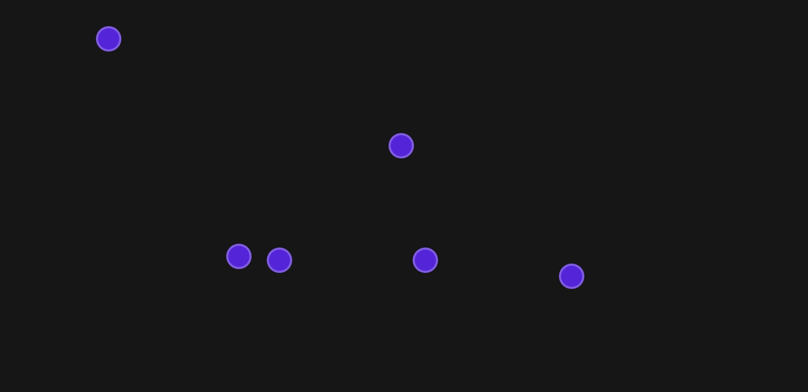

⚠️ Please note that this is an old project and does not reflect the quality of my current work.

# Click Accuracy Game

A native JavaScript ES6+ object-orientated click accuracy game.

## Description

This is a game which tests mouse accuracy and click speed by generating clickable targets at random coordinates and calculating metrics at the end.

## Motivation

I built this game to learn more about object oriented programming and to better my native JavaScript skills.
